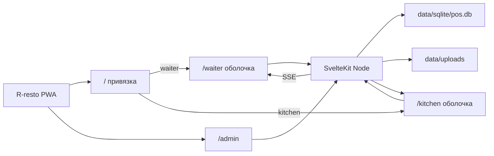
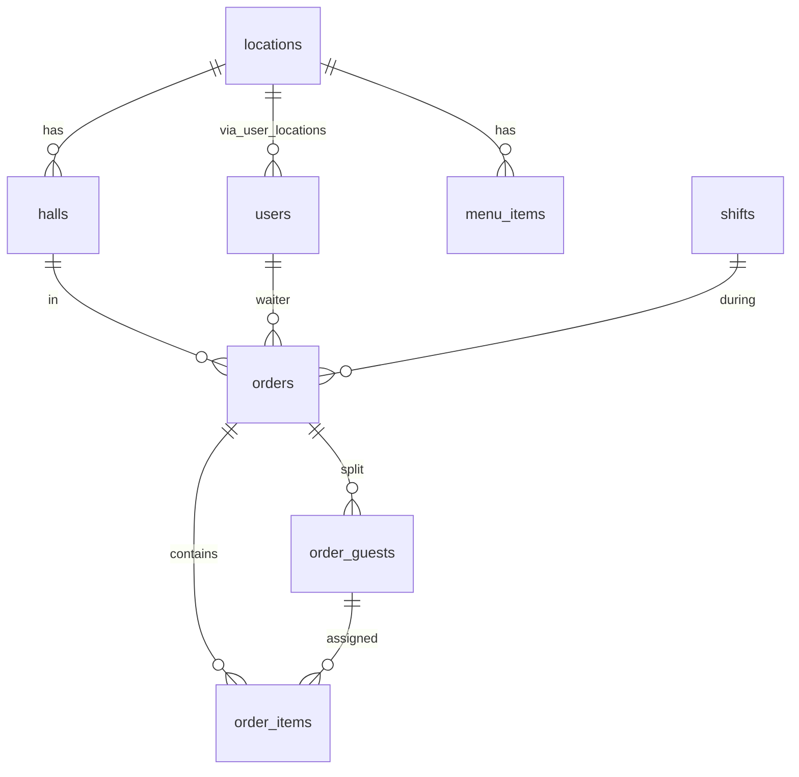

# Архитектура R-resto

POS / KDS / админка одним Node-процессом. Код: [`app/`](../app/). Данные: [`data/`](../data/).

Связанные документы: [`WAITER_UX.md`](WAITER_UX.md), [`../AGENTS.md`](../AGENTS.md).

## 1. Стек

- **SvelteKit 2** + **Svelte 5** (runes), TypeScript.
- **Адаптер:** `@sveltejs/adapter-node` (не serverless, не static).
- **Клиент:** одна SPA (`ssr = false` в корневом layout). Один origin с API. Официант и кухня — отдельные оболочки (`waiter/+layout`, `kitchen/+layout`), не отдельные сборки.
- **PWA:** одно устанавливаемое приложение. `static/manifest.webmanifest` (`start_url` / `scope` `/`), PNG 192/512 + maskable, `apple-touch-icon.png`, `src/service-worker.ts`. Навигации — network-first; `/_app/immutable/*` — cache-first; остальной static — stale-while-revalidate. `/api/*` и SSE всегда из сети. Меню на клиенте обновляется событием `MENU_UPDATED`.
- **БД:** SQLite, `better-sqlite3`, **без ORM**. WAL.
- **Realtime:** Server-Sent Events (`GET /api/events`). REST пишет, SSE рассылает.
- **Отчёты:** ExcelJS на сервере.
- **Загрузки:** файлы на диск `data/uploads`, в БД только относительный путь.



## 2. Роли и доступ

**Официант и кухня** — BYOD, без логина:

1. Браузер получает cookie `device_uuid` (hooks).
2. Если устройства нет — `pending`, на экране 6-значный `device_code` (`481-902`).
3. Админ вводит код, назначает точку и пользователя с ролью `waiter` или `kitchen` (не admin).
4. Статус `active`. Клиент по SSE `DEVICE_ACTIVATED` уходит на `/waiter` или `/kitchen`.
5. `suspended` / `terminated` → SSE `DEVICE_BLOCKED` → экран привязки.

**Админ** — не устройство, а PIN:

1. Открывает `/admin`.
2. Если админов несколько — выбирает имя, затем цифровой пароль на нумпаде (4–8 цифр).
3. `POST /api/admin/login` → cookie `admin_session` (~12 часов), таблица `admin_sessions`.
4. Суперадмин (`users.is_superadmin`): имя «Администратор», пароль по умолчанию **1708**. Хеш `pin_hash` через scrypt. Нельзя удалить и снять роль.
5. При создании нового админа обязательно задаётся цифровой PIN.

Один сотрудник зала может быть на нескольких устройствах. Официант видит пречеки своей точки; фильтр по залу — в шапке.

## 3. Доменная модель

**Деньги только в копейках (`INTEGER`).** `1 850 ₽` = `185000`.



| Сущность | Смысл |
| --- | --- |
| `locations` | Торговая точка (заведение) |
| `halls` | Зал внутри точки, `color_hex` для шапки официанта |
| `users` | `waiter` / `kitchen` / `admin`; у админа `pin_hash`, у суперадмина `is_superadmin` |
| `admin_sessions` | Сессия PIN-входа, cookie `admin_session` |
| `devices` | Телефон/планшет, код, uuid, статус |
| `menu_categories`, `menu_items` | Справочник; `is_available` = стоп-лист; `image_path` |
| `shifts` | Кассовая смена точки |
| `orders` | Пречек: `open` / `closed` / `cancelled` |
| `order_guests` | Гости сплита, оплата каждого |
| `order_items` | Позиции: цена зафиксирована; статус кухни |
| `expenses` | Расходы смены: `shift_id`, `payment_method` (`cash` / `cashless`), сумма, примечание |

### Статусы позиции (`order_items.status`)

| Статус | Кто ставит | KDS |
| --- | --- | --- |
| `held` | официант набрал, ещё не отправил | не виден |
| `pending` | «На кухню» | карточка / строка |
| `ready` | кухня «Готово» | зелёный маркер |
| `out_of_stock` | кухня «Нет блюда» | красный, алерт официанту |

Кухня не видит `held`. Официант не удаляет `pending+` (только админ отменяет пречек).

### Закрытие пречека

`orders.status = closed` только когда **все** `order_guests.is_paid = 1`. Частичная оплата оставляет пречек в активных. Отмена — только админ, с обязательной причиной; SSE `PRECHECK_CANCELLED` снимает карточку с KDS.

## 4. SSE-события

Канал: `GET /api/events` (cookie устройства). Heartbeat `: ping` каждые 15 с.

| Событие | Источник | Получатели |
| --- | --- | --- |
| `DEVICE_ACTIVATED` / `DEVICE_BLOCKED` | админ | это устройство |
| `MENU_UPDATED` | админ (CRUD / стоп-лист) | официанты точки |
| `PRECHECK_CREATED` / `PRECHECK_UPDATED` | официант | кухня, админ, другие официанты точки |
| `PRECHECK_CANCELLED` / `PRECHECK_CLOSED` | админ / оплата | официант, кухня |
| `ITEM_STATUS_CHANGED` | кухня | официант |
| `SHIFT_OPENED` / `SHIFT_CLOSED` | админ | все терминалы точки |

Клиент: один `EventSource` на POS-сессию (`lib/client/pos-session.svelte.ts`) с reconnect/backoff. Страницы подписываются на события, не открывают свой канал. Конструктор официанта на `MENU_UPDATED` перезапрашивает `GET /api/menu`. Не кэшировать SSE и `/api/*` в SW.

## 5. HTTP API (скелет)

Префикс `/api`. JSON, копейки в числах.

- `POST /api/devices/register` — код или уже active+роль
- `GET /api/devices/me`
- `GET /api/admin/login` — список админов для экрана входа
- `POST /api/admin/login` — `{ userId, pin }`
- `POST /api/admin/logout`
- `GET /api/admin/me`
- `POST /api/admin/devices/bind` — код + waiter/kitchen
- `GET|POST /api/orders`, `POST /api/orders/:id/items`, split, pay, fire
- `GET /api/kds` — очередь кухни (открытые пречеки с pending+); экран `/kitchen` показывает FIFO-список (read-only, без кнопок статуса)
- `PATCH /api/kds/items/:id` — ready / out_of_stock (скелет API; кнопки KDS ещё не в UI)
- `GET|POST /api/menu`, upload картинки
- `GET|POST /api/shifts`, close + Z (открытие смены — сессия админа; закрытие — только без открытых пречеков)
- `GET /api/admin/shifts` — текущая и закрытые смены с чеками, выручкой и расходами
- `GET /api/admin/prechecks` — чеки открытой смены
- `POST /api/admin/prechecks/:id/cancel` — `{ reason }` обязательно
- `POST /api/admin/expenses`, `DELETE /api/admin/expenses/:id` — расходы открытой смены
- `GET /api/admin/analytics?from&to` — товары vs прошлый период той же длины
- `GET /api/admin/export?from&to` — xlsx (Чеки, Товары, Сравнение, Расходы)
- `GET /api/events` — SSE

Терминал: cookie `device_uuid`, `devices.status = active`. Админские пути: cookie `admin_session`, не роль на устройстве.

## 6. Каталоги `app/src`

```text
src/
  hooks.server.ts          # cookie, migrate side-effect via db import
  service-worker.ts       # PWA: network-first navigate, exclude /api
  lib/
    money.ts
    types.ts
    client/pos-session.svelte.ts  # device + один SSE для POS
    components/            # PosShell, PosRoleGate, плитки, шторка
    server/
      paths.ts
      sse.ts
      db/index.ts          # singleton
      db/migrate.ts
      db/migrations/
  routes/
    +layout.ts             # ssr = false, currency в data
    +page.svelte           # привязка
    waiter/+layout.svelte  # гард роли waiter, тёмная оболочка
    kitchen/+layout.svelte # гард роли kitchen, тёмная оболочка
    admin/{devices,menu,shift,analytics,finance}
    api/...
```

PWA-файлы в `app/static/`: `manifest.webmanifest`, `icon-192.png`, `icon-512.png`, `icon-maskable-512.png`, `apple-touch-icon.png`, SVG-исходники иконок.

## 7. Данные и Docker

- `DATABASE_PATH`, `UPLOADS_PATH`. Compose монтирует `./data:/data`.
- Dev: hot reload, volume `app_node_modules` чтобы не затирать native-модуль.
- Prod: multi-stage, `node build`, порт 3000, `HOST=0.0.0.0`.

Миграции на старте **первого** обращения к БД (`getDb()`), не при импорте модуля (иначе `vite build` открывает SQLite). SQL подключается через `?raw`.

## 8. Фазы реализации UI

1. Устройства + SSE + редирект роли (каркас уже есть).
2. Официант: список, плитки, шторка, гости/сплит, fire, оплата.
3. KDS.
4. Админ: устройства, меню/uploads, отмена, смена, Excel/P&L.
5. PWA: одно приложение, PNG-иконки, standalone, SW без кэша API; жесты официанта в браузере.
